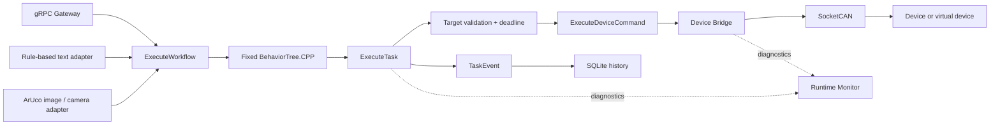

# Embodied Agent Runtime

[](https://github.com/Quchaosheng/embodied-agent-runtime/actions/workflows/ros2-ci.yml)
[](https://docs.ros.org/en/jazzy/)
[](#platform-status)
[](LICENSE)

A deterministic ROS 2 task runtime that connects controlled workflow inputs to
fixed BehaviorTree.CPP orchestration, nested ROS 2 Actions, SocketCAN device
control, runtime diagnostics, and SQLite task history.

The software path is implemented and tested. Native ARM boards, physical CAN,
cameras, motors, and hardware emergency-stop behavior remain hardware
validation work.

## Runtime Architecture



Models and perception adapters cannot directly control a device. They can only
submit allowlisted workflows through `ExecuteWorkflow`; the executable control
flow remains fixed and reviewable.

## Implemented Components

| Package | Responsibility |
| --- | --- |
| `robot_task_interfaces` | ROS 2 Actions, messages, and service contracts |
| `runtime_can` | Fixed classic-CAN protocol encoding, decoding, and validation |
| `virtual_can_device` | Software ECU used for normal, fault, delay, and dropped-ACK tests |
| `device_bridge` | SocketCAN command transport, ACK retry, STOP, cancellation, and diagnostics |
| `task_executor` | Target allowlist, deadline budgeting, nested Action execution, and `TaskEvent` output |
| `runtime_monitor` | Aggregated readiness and degraded/error diagnostics |
| `runtime_history` | SQLite task persistence, lookup, and percentile statistics |
| `task_orchestrator` | Fixed BehaviorTree.CPP workflows and bounded child cancellation |
| `runtime_gateway` | Loopback gRPC API, request identity, duplicate suppression, and Action bridge |
| `ai_task_adapter` | Optional rule-based text-to-workflow adapter; not a real LLM |
| `perception_task_adapter` | Optional ArUco image or USB-camera workflow trigger |

## Verified Software Evidence

On 2026-07-18, this Windows host completed the isolated WSL2/Jazzy build and
test flow with **11 packages, 385 tests, 0 errors, 0 failures, and 72 skips**.
GitHub Actions also passed the Windows tooling checks and the Ubuntu
24.04/Jazzy build, test, ARM64-configuration, and conditional `vcan0` workflow.
This remains software-only evidence.

The industrial `vcan0` E2E script verifies these seven scenarios:

| Scenario | Verified result |
| --- | --- |
| `normal` | `COMPLETED/0` |
| `fault302` | `DEVICE_FAULT/302` |
| `cancel` | `CANCELED/0`, protocol STOP acknowledged |
| `drop_stop_ack` | `SAFE_STOP/204`, no STOP response received |
| `ack_timeout` | `SAFE_STOP/201`, protocol STOP acknowledged |
| `duplicate` | One Gateway dispatch, one workflow Goal, one task Goal, one history record |
| `stats` | Six samples, outcome counts `[2,1,2,1]`, matching gRPC/SQLite percentiles |

Run the same software E2E after building:

```bash
WORKSPACE="$PWD/ros2_ws" SETUP_VCAN=0 bash scripts/run_industrial_e2e.sh
```

`vcan0`, the virtual device, generated images, and Fake Action servers are test
substitutes. They are not physical-hardware evidence.

## Quick Start

### Windows With WSL2

From the repository root in Windows PowerShell:

```powershell
powershell.exe -NoProfile -ExecutionPolicy Bypass `
  -File .\scripts\windows_wsl.ps1 -Mode Check

powershell.exe -NoProfile -ExecutionPolicy Bypass `
  -File .\scripts\windows_wsl.ps1 -Mode BuildTest
```

The default distribution is `Ubuntu-24.04`. The script checks an existing WSL2
environment, never invokes `sudo`, and keeps build artifacts in the WSL-native
`$HOME/.cache/embodied-agent-runtime-wsl` tree. Use `-DryRun` to inspect the
selected behavior without invoking WSL.

### Ubuntu 24.04 / ROS 2 Jazzy

```bash
set +u
source /opt/ros/jazzy/setup.bash
set -u
cd ros2_ws
rosdep install --from-paths src --ignore-src --rosdistro jazzy -y
colcon build --cmake-args -DBUILD_TESTING=ON
colcon test --return-code-on-test-failure
colcon test-result --test-result-base build --verbose
```

### Native ARM64

Do not reuse x86_64 build, install, or log directories on an ARM board.

```bash
RUNTIME_PLATFORM_PROFILE=generic-arm64 ROS_DISTRO=jazzy \
  bash scripts/check_arm64_environment.sh
bash scripts/build_on_arm64.sh
bash scripts/run_arm64_smoke.sh
```

For an RK3568 image based on Ubuntu 22.04, use the supported Humble pair:

```bash
RUNTIME_PLATFORM_PROFILE=rk3568 ROS_DISTRO=humble \
  bash scripts/check_arm64_environment.sh
RUNTIME_PLATFORM_PROFILE=rk3568 ROS_DISTRO=humble \
  bash scripts/build_on_arm64.sh
RUNTIME_PLATFORM_PROFILE=rk3568 ROS_DISTRO=humble \
  bash scripts/run_arm64_smoke.sh
```

The ARM scripts accept only Jazzy/Ubuntu 24.04 and Humble/Ubuntu 22.04 pairs.

## Optional Workflow Inputs

### Rule-Based Text Input

`ai_task_adapter` maps controlled text patterns to allowlisted workflow goals.
It is a deterministic adapter for exercising the workflow boundary, not a
large-language-model integration.

### ArUco Input

`perception_task_adapter` detects `DICT_4X4_50` markers from an image or USB
camera and submits through `ExecuteWorkflow`.

| Marker ID | Workflow | Target |
| --- | --- | --- |
| `10` | `single_task` | `dock_a` |
| `20` | `ready_then_task` | `home` |

Camera mode requires three consecutive matching frames, suppresses duplicate
submissions, rearms after five empty frames, and rejects frames containing
multiple mapped markers. Automated evidence currently uses generated images.

## Platform Status

| Environment | Current status | Evidence |
| --- | --- | --- |
| Windows + WSL2, x86_64 | Software verified | Isolated Jazzy build and 385-test result |
| Ubuntu 24.04 + Jazzy, x86_64 | CI verified | Build, tests, configuration checks, conditional `vcan0` E2E |
| Generic ARM64 Linux | Prepared, native run pending | Environment, build, and smoke scripts |
| RK3568 | CPU-only ARM64 profile, native run pending | No vendor NPU/GPIO/camera claims |
| X5 | Target-intent profile, native run pending | No BPU or board-camera integration yet |
| 32-bit ARM | Unsupported | The runtime targets 64-bit Linux |

Board-specific BPU/NPU runtimes, cameras, GPIO, and physical CAN adapters stay
behind the existing input and device boundaries.

## Hardware Demo

> **Status:** pending physical hardware evidence.

After board bring-up, this section will contain a real robot frame linked to a
GitHub Release, Bilibili, or YouTube video. The recording should show:

1. Native ARM64 environment check, build, and smoke test.
2. Physical-camera ArUco detection and workflow submission.
3. Physical CAN command, ACK, retry, and STOP traffic.
4. The actuator response, including the distinction between software
   `SAFE_STOP` and the hardware emergency-stop circuit.

A small GIF may be used as a preview; large MP4 files should remain outside the
Git repository.

## Evidence Boundary

| Demonstrated | Not yet demonstrated |
| --- | --- |
| Fixed workflow orchestration and nested ROS 2 Actions | Dynamic model-generated control flow |
| Generated ArUco image flow and Fake Action integration | Physical USB or board-camera compatibility |
| SocketCAN `vcan0`, virtual ECU, retry, cancel, and STOP protocol | Physical CAN wiring, transceiver, or motor behavior |
| Software `SAFE_STOP` outcomes and persisted task evidence | Hardware emergency stop or measured stopping distance |
| x86_64 WSL2 and Ubuntu/Jazzy software runs | Native RK3568/X5 execution and vendor accelerators |

The loopback Gateway also does not yet provide TLS, authentication, high
availability, or measured production-throughput evidence.

## License

Licensed under the [Apache License 2.0](LICENSE). Third-party attribution is in
[THIRD_PARTY_NOTICES.md](THIRD_PARTY_NOTICES.md).
