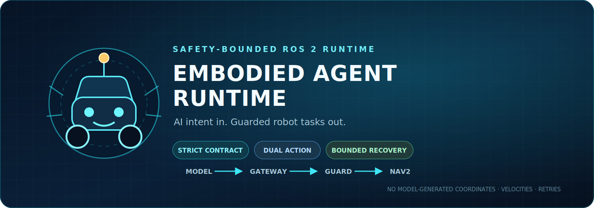
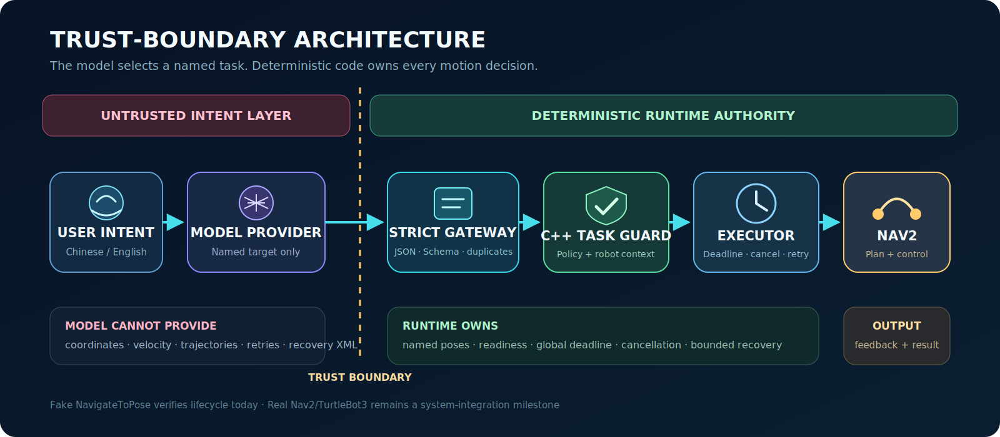
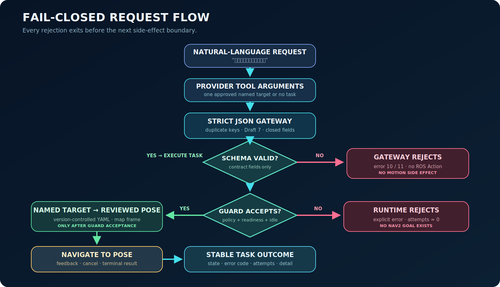
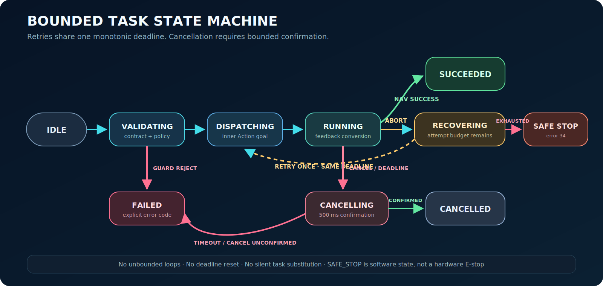

  

<h1 align="center">Embodied Agent Runtime</h1>

  <strong>A safety-bounded bridge between probabilistic AI intent and deterministic robot execution.</strong>

  
  
  
  
  
  
  

  <a href="#中文速览">中文速览</a> ·
  <a href="#architecture">Architecture</a> ·
  <a href="#build-and-test">Build &amp; Test</a> ·
  <a href="docs/project-talking-points.zh-CN.md">Project Notes</a>

A safety-bounded ROS 2 runtime that lets an AI model request approved robot
tasks without giving the model direct control of coordinates, velocity,
trajectories, recovery logic, or Nav2.

> Current status: the integration branch combines six ROS 2 packages and the
> independently verified Runtime, AI Gateway, bounded mission planner, SocketCAN
> readiness, and TaskEvent MCAP smoke paths. It requires one fresh merged CI run
> before a new combined test total is claimed. A provider-independent ROS
> Action bridge and offline Fake AI now turn Chinese user intent into one guarded
> task or a bounded 1-3 step mission. A version-controlled set of 20 Chinese intent
> cases checks accepted, unsupported, negated, multi-target, and prompt-injection
> inputs. Official OpenAI and configurable OpenAI-compatible relay profiles,
> plus a no-ROS provider probe, are implemented and tested offline; no real
> model service is connected yet.
> Runtime launch tests cover outer Action success, feedback,
> Guard rejection, confirmed cancellation, global deadline expiry, and process
> cleanup. Bounded retry, recovery exhaustion, and SAFE_STOP are also verified.
> Runtime readiness now comes from the live `map -> base_link` TF and Nav2
> Action discovery instead of hard-coded booleans. Concurrent Goals are
> serialized by an atomic task reservation and readiness is published on the
> standard `/diagnostics` topic. An optional read-only `device_bridge` now
> converts a versioned SocketCAN heartbeat into a fail-closed readiness input;
> real motor control and hardware safety remain out of scope.
> Version-controlled target pose loading is complete. Local Nav2/TurtleBot3
> simulation evidence exists; physical hardware and fresh merged CI evidence remain separate gates.

## 中文速览

这是一个“AI 只表达任务意图、确定性 Runtime 掌握运动安全边界”的 ROS 2
项目。模型只能从 `dock`、`workbench`、`home` 中请求一个命名目标；坐标、deadline、
取消确认、重试上限、恢复策略和 Nav2 调用全部由受测试的 C++ Runtime 控制。

### 可量化工程量

| 维度 | 当前证据 |
| --- | --- |
| ROS 2 包 | 6 个：契约、Guard、执行器、AI Gateway、SocketCAN Device Bridge、Nav2 仿真编排 |
| 双层 Action | 外层 `ExecuteTask` + 内层真实 `NavigateToPose` 接口 |
| 安全机制 | 严格 Schema、TF/Nav2/CAN readiness、原子 BUSY、全局 deadline、确认取消、有限恢复 |
| 自动化测试 | 合并前分支各自通过 C++/Python/launch 测试；合并后的精确总数以 CI 结果为准 |
| AI 评测 | 20 条单任务中文语料与 12 条 Mission 语料；合并后的精确结果由 CI 重新记录 |
| 可重复演示 | Runtime、AI→ROS、AI Mission、TaskEvent MCAP 审计、无 ROS Provider probe、真实 `PF_CAN` vcan smoke |
| 模型接入 | Fake、官方 OpenAI、OpenAI-compatible 中转站三种 profile |
| 工程化 | GitHub Actions、发布自检、贡献规范、安全说明、变更记录 |
| 学习沉淀 | 20 课中文实现笔记与可复习技术复习问答 |

项目保留本地 Nav2/TurtleBot3 仿真证据，但没有把真实模型联网、物理 CAN、物理停止或硬件安全说成已完成。README、测试输出和 roadmap 明确区分这些边界。

## Why this project exists

An AI model is useful for interpreting user intent, but robot motion is a poor
place for unconstrained generation. This project separates those concerns:

- The model selects a small, named task such as navigate to dock.
- The C++ runtime owns target poses, deadlines, readiness checks, cancellation,
  retry limits, and every ROS navigation call.
- Nav2 owns planning, control, and local obstacle avoidance.

The key rule is simple: an invalid or unsafe request must be rejected before a
Nav2 Goal exists.

## Architecture

    SocketCAN controller heartbeat                untrusted device input
      -> device_bridge                            Linux PF_CAN parser + timeout
      -> /device_ready                            optional Runtime readiness input

    User intent
      -> MissionModel.plan()                      closed 1-3 step MissionPlan
      -> MissionRunner                            serial steps and bounded choices
      -> ExecuteTask                              Guarded task boundary for every step
      -> Nav2 / TurtleBot3 simulation             local system evidence

The Guard decision combines three inputs:

    TaskRequest + GuardPolicy + RobotContext -> ValidationResult

- TaskRequest: what the caller wants.
- GuardPolicy: what this deployment permits.
- RobotContext: whether the robot is currently ready and idle.

### Fail-closed request flow

Every rejection exits before the next side-effect boundary. Invalid model
output creates no ROS Action; Guard rejection creates no inner Nav2 Goal.

## Safety contract

The model-facing request is deliberately narrow:

    {
      "contract_version": 1,
      "action": "navigate",
      "target": "dock",
      "deadline_s": 90
    }

The model cannot provide coordinates, velocity commands, trajectories,
behavior-tree XML, retry counts, or recovery policy. Named targets are mapped
to reviewed poses by runtime configuration.

## Bounded execution state machine

Retries reuse the original monotonic deadline. Cancellation is not reported as
complete until the inner Action reaches a confirmed terminal canceled state
within the bounded window.

## Implemented today

- ROS Action and message definitions in task_contract.
- JSON Schema with a closed field set, named targets, and a bounded deadline.
- C++ task types, states, and explicit error codes.
- task_guard checks contract version, action, target, deadline, active-task
  state, localization readiness, navigation readiness, and optional device readiness.
- `task_executor` derives localization readiness from the live
  `map -> base_link` TF and navigation readiness from Nav2 Action discovery.
- An atomic task reservation rejects overlapping valid Goals with error 15;
  RAII releases the slot on success, rejection, cancellation, timeout, or recovery failure.
- `/diagnostics` reports localization, navigation, optional device readiness,
  task-active state, and the required frame pair once per second.
- `device_bridge` reads a strict two-byte heartbeat from a real Linux `PF_CAN`
  raw socket and publishes fail-closed readiness after malformed, not-ready,
  missing, or stale input. It sends no actuator command frames.
- Version-controlled YAML GuardPolicy loading with fail-closed validation.
- Strict Gateway JSON parsing, duplicate-field rejection, and Draft 7 Schema validation.
- Provider-independent Gateway Action Client, generated task IDs, stable
  feedback/result objects, offline Fake AI, and a natural-language CLI.
- Configurable OpenAI-compatible provider with one closed-schema task tool,
  environment-only credentials, bounded HTTP response size, and fail-closed
  handling when intent is unsupported, ambiguous, or produces invalid output.
- Separate official OpenAI and relay profiles, configurable model/base URL,
  remote HTTPS enforcement, and a one-request probe that sends no ROS Action.
- Version-controlled AI intent evaluation with 12 accepted commands and 8
  fail-closed cases, including negation, multiple targets, and prompt injection.
- Outer ExecuteTask Action Server with named-target mapping and bounded inner
  cancellation confirmation.
- Reliable transient-local `TaskEvent` stream for validation, dispatch,
  running, recovery, cancellation, and every terminal state; late subscribers
  can inspect the most recent 50 transitions without replaying a task.
- Standard rosbag2/MCAP persistence proof that records one successful task and
  one Guard rejection, reads the bag back, and asserts exact state order,
  terminal error code, and attempt count.
- Global task deadline based on monotonic time, followed by a fixed 500 ms
  cancellation-confirmation grace period.
- Version-controlled recovery policy with two total navigation attempts.
- Explicit `RECOVERING` feedback and `SAFE_STOP + kRecoveryExhausted` after
  the reviewed attempt budget is exhausted.
- Fail-closed named-target YAML loading with exact contract coverage, map-frame
  enforcement, finite coordinates, normalized yaw, and quaternion conversion.
- Deterministic fake NavigateToPose Action Server using the real `nav2_msgs`
  interface.
- Unit tests for accepted requests, semantic rejection, invalid policy files, and malformed JSON.
- `launch_testing` coverage for feedback/result mapping, unknown targets,
  cancellation propagation, and clean process shutdown.

## Roadmap

| Milestone | Status | Evidence |
| --- | --- | --- |
| M0 environment and first build | Complete | Both packages build; Guard tests pass |
| M1 contract and semantic Guard | Complete | Guard, YAML policy, and strict JSON adapter verified |
| M2 outer Action and fake navigation | Complete | Success, feedback, rejection, cancel, and timeout tests pass |
| M3 bounded recovery | Complete | Retry success, exhaustion, SAFE_STOP, and shared deadline verified |
| M4 Nav2 and TurtleBot3 | Local evidence | A local headless `dock -> workbench` Runtime mission reached active Nav2; physical hardware remains separate |
| M5 gateway, mission, and observability | In progress | Provider profiles, bounded MissionPlan, diagnostics, SocketCAN readiness, TaskEvent, and MCAP audit are present; Foxglove remains |
| M6 regression and release | In progress | CI now covers all six packages and smoke paths; the merged matrix must run before release |

## Build and test

Prerequisites: Ubuntu 24.04, ROS 2 Jazzy, colcon, and rosdep. Deactivate Conda
before building so CMake uses /usr/bin/python3.

    cd ~/embodied_ws
    source /opt/ros/jazzy/setup.bash
    rosdep install --from-paths src --ignore-src --rosdistro jazzy -r -y
    colcon build --symlink-install --packages-up-to task_executor agent_gateway device_bridge runtime_simulation
    source install/setup.bash
    colcon test --packages-select task_contract task_guard task_executor agent_gateway device_bridge runtime_simulation
    colcon test-result --verbose

Run the complete pre-push release gate from the repository root:

    bash scripts/verify_release.sh

This command checks repository metadata and possible credentials, rebuilds all
six packages, runs the complete test result set and focused bag-reader test,
evaluates fixed intent and mission cases, and runs the portable smoke tests.
GitHub Actions reproduces the Ubuntu 24.04/Jazzy evidence; the `vcan0` proof
remains conditional on kernel-module access and full Gazebo simulation remains
outside the fast release gate.

Run the process-level M2 proof after building:

    bash src/embodied-agent-runtime/scripts/smoke_phase_2.sh

Current milestone evidence:

    Pending: run the merged CI matrix before recording a combined package and test summary.

Run the offline AI-to-ROS proof:

    bash src/embodied-agent-runtime/scripts/smoke_ai_gateway.sh

The smoke defaults explicitly to Fake Provider. After configuring OpenAI or a
relay, opt into one live model request while still using fake navigation:

    AI_SMOKE_PROVIDER=openai bash src/embodied-agent-runtime/scripts/smoke_ai_gateway.sh
    AI_SMOKE_PROVIDER=openai-compatible bash src/embodied-agent-runtime/scripts/smoke_ai_gateway.sh

Before any ROS process, verify one model request with the no-motion probe:

    ros2 run agent_gateway probe_provider --provider openai "回充电桩"
    ros2 run agent_gateway probe_provider --provider openai-compatible "回充电桩"

Run the fixed 20-case Chinese intent evaluation without network access:

    ros2 run agent_gateway evaluate_intents --provider fake

Run the bounded 1-3 step Mission path with the offline Fake Provider:

    ros2 run agent_gateway evaluate_missions --provider fake
    ros2 run agent_gateway probe_mission --provider fake "先去充电桩，再去工作台"
    ros2 run agent_gateway run_mission --provider fake --yes "先去充电桩，再去工作台"

Every Mission step still enters through `ExecuteTask` and the C++ Guard. The
model can only choose reviewed named targets and bounded Runtime transitions;
it cannot send coordinates, Nav2 Goals, CAN frames, or actuator commands.

After configuring a real compatible service, the same command can evaluate it:

    ros2 run agent_gateway evaluate_intents --provider openai-compatible

Real-provider evaluation sends 20 model requests and may incur service cost. A
request that is unsupported, negated, or asks for multiple targets is expected
to produce no tool call and is rejected before ROS.

The AI smoke verifies live feedback and a successful terminal result.
The Runtime smoke separately verifies `final_state: 5` for `dock`, then checks
that `laboratory` returns `error_code: 13` with `attempts: 0` before an inner
navigation Goal is sent.

Observe the live Runtime readiness used by the Guard:

    ros2 topic echo /diagnostics diagnostic_msgs/msg/DiagnosticArray

Production mode requires a valid `map -> base_link` transform and a discovered
`NavigateToPose` Action server. The two deterministic smoke scripts explicitly
set `localization_check_enabled:=false` because their fake navigation process
has no localization or TF tree; diagnostics reports this bypass as `WARN`.

Run the SocketCAN readiness proof from the repository root after creating
`vcan0` and installing `can-utils`:

    sudo modprobe vcan
    sudo ip link add dev vcan0 type vcan 2>/dev/null || true
    sudo ip link set vcan0 up
    EMBODIED_WS=~/embodied_ws bash scripts/smoke_vcan_readiness.sh

The smoke uses Linux `PF_CAN`, not a ROS Topic pretending to be CAN. It proves
three states: missing heartbeat rejects with error 18 and zero attempts, valid
periodic heartbeat permits one task, and stale heartbeat rejects again. This is
a communication-readiness proof, not motor control, an emergency stop, or a
hardware safety certification.

Observe task transitions without becoming the Action client:

    ros2 topic echo /task_events task_contract/msg/TaskEvent \
      --qos-reliability reliable \
      --qos-durability transient_local \
      --qos-depth 50

The retained DDS history is process-local. Persist and verify it across process
restarts with standard rosbag2/MCAP:

    EMBODIED_WS=~/embodied_ws bash scripts/smoke_task_event_bag.sh

The smoke records `bag-success` and `bag-rejected`, reads the generated bag
through `rosbag2_py`, and checks exact state sequences and terminal fields.
Generated bags stay under the temporary directory and are never committed.
Foxglove integration remains a separate roadmap item.

## Repository map

| Directory | Responsibility |
| --- | --- |
| task_contract | ROS interfaces, JSON Schema, task types, and error codes |
| task_guard | C++ validation and static safety policy |
| task_executor | Outer Action Server and inner Nav2 Action Client |
| agent_gateway | Model-output normalization, provider boundary, and outer Action Client |
| device_bridge | Read-only SocketCAN heartbeat parser and readiness diagnostics |
| simulation | TurtleBot3/Nav2 maps, targets, and launch configuration |
| test | Deterministic fault and simulation scenarios |
| docs | Architecture, roadmap, learning, and project material |

## Open-source foundation

This project is built on ROS 2 and focused upstream libraries; it does not copy
their source trees into this repository. Direct dependencies are declared in
the six ROS package manifests and installed reproducibly with `rosdep`.

- ROS 2 Jazzy and ament provide nodes, Actions, interfaces, and the build model.
- Navigation2 provides the real `NavigateToPose` Action interface.
- Linux SocketCAN provides the raw CAN receive boundary; `can-utils` drives the
  reproducible `vcan0` smoke test.
- yaml-cpp loads reviewed runtime policy and named targets.
- python-jsonschema validates model-facing requests.
- GoogleTest, pytest, and launch_testing provide verification.

See `THIRD_PARTY_NOTICES.md` for project links, license identifiers, and a
strict separation between current dependencies and planned/reference-only
projects. OpenAI-compatible support is a protocol integration using the Python
standard library; no OpenAI SDK source is bundled.

## GitHub release quality

- `.github/workflows/ros2-ci.yml` rebuilds on a clean Ubuntu 24.04 GitHub runner
  with ROS 2 Jazzy.
- `.github/CODEOWNERS` assigns review ownership to `@Quchaosheng`.
- `scripts/verify_release.sh` is the local pre-push gate.
- `CONTRIBUTING.md` records safety-preserving change rules.
- `SECURITY.md` defines credential handling and the non-certified safety scope.
- `CHANGELOG.md` separates delivered evidence from unfinished integration.
- `LICENSE` publishes the repository under Apache-2.0.
- `THIRD_PARTY_NOTICES.md` records direct upstream dependencies and licenses.
- `.gitignore` excludes ROS build trees, Python caches, local environments,
  private keys, generated MCAP bags, and editor state.

The workflow intentionally uses only Fake Provider. GitHub secrets are not
required, and CI cannot spend model credits or send a robot Action to real
hardware.

## Project and design notes

- Chinese project answers: docs/project-talking-points.zh-CN.md
- Latest guided lesson: docs/learning-session-20-rosbag-task-audit.zh-CN.md
- GitHub release lesson: docs/learning-session-15-github-release-engineering.zh-CN.md
- TaskEvent observability lesson: docs/learning-session-16-task-event-observability.zh-CN.md
- Rosbag task audit lesson: docs/learning-session-20-rosbag-task-audit.zh-CN.md
- Nav2/TurtleBot3 system lesson: docs/learning-session-17-nav2-turtlebot3-simulation.zh-CN.md
- Bounded AI Mission lesson: docs/learning-session-18-bounded-ai-mission-agent.zh-CN.md
- Architecture and trust boundary: docs/architecture.md
- Ordered implementation roadmap: docs/project-roadmap.md
- Final demonstration: docs/final-demo-spec.md

The README states current implementation separately from planned work so the
project can be explained accurately in an project.
