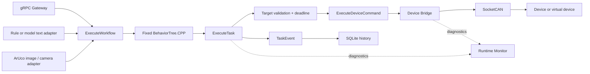
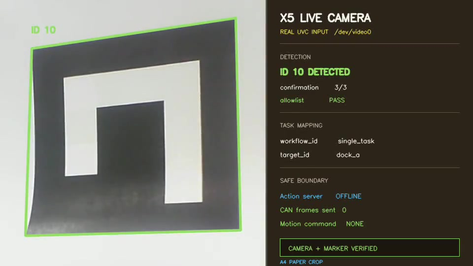

# Embodied Agent Runtime

**English** | [简体中文](README.zh-CN.md)

[](https://github.com/Quchaosheng/embodied-agent-runtime/actions/workflows/ros2-ci.yml)
[](https://docs.ros.org/)
[](#platform-status)
[](LICENSE)

A deterministic ROS 2 task runtime that connects controlled workflow inputs to
fixed BehaviorTree.CPP orchestration, nested ROS 2 Actions, SocketCAN device
control, runtime diagnostics, and SQLite task history.

The software path is implemented and tested. Native X5/ARM64 execution, a
physical USB camera, ArUco detection, and bidirectional SocketCAN bench traffic
have also been verified. Actuator motion and a hardware emergency-stop circuit
remain outside the demonstrated scope.

## Runtime Architecture


```mermaid
flowchart LR
    G["gRPC Gateway"] --> W["ExecuteWorkflow"]
    A["Rule or model text adapter"] --> W
    P["ArUco image / camera adapter"] --> W
    W --> B["Fixed BehaviorTree.CPP"]
    B --> T["ExecuteTask"]
    T --> V["Target validation + deadline"]
    V --> D["ExecuteDeviceCommand"]
    D --> R["Device Bridge"]
    R --> C["SocketCAN"]
    C --> E["Device or virtual device"]
    T --> X["TaskEvent"]
    X --> H["SQLite history"]
    R -. diagnostics .-> M["Runtime Monitor"]
    T -. diagnostics .-> M
```

Models and perception adapters cannot directly control a device. They can only
submit allowlisted workflows through `ExecuteWorkflow`; the executable control
flow remains fixed and reviewable.

This is an application-level boundary, not a substitute for ROS 2/DDS access
control or CAN bus authentication. Production deployment must isolate the ROS
domain, enable DDS Security where applicable, and treat a matching CAN ACK as a
protocol response rather than proof of physical actuator motion.

## Implemented Components

| Package | Responsibility |
| --- | --- |
| `robot_task_interfaces` | ROS 2 Actions, messages, and service contracts |
| `runtime_can` | Fixed classic-CAN protocol encoding, decoding, and validation |
| `virtual_can_device` | Software ECU used for normal, fault, delay, and dropped-ACK tests |
| `device_bridge` | SocketCAN command transport, ACK retry, STOP, cancellation, and diagnostics |
| `task_executor` | Target allowlist, deadline budgeting, nested Action execution, and `TaskEvent` output |
| `runtime_monitor` | Aggregated readiness and degraded/error diagnostics |
| `runtime_history` | SQLite task persistence, lookup, and percentile statistics |
| `task_orchestrator` | Fixed BehaviorTree.CPP workflows and bounded child cancellation |
| `runtime_gateway` | Loopback gRPC API, request identity, duplicate suppression, and Action bridge |
| `ai_task_adapter` | Deterministic rule planner plus optional OpenAI-compatible model adapter |
| `perception_task_adapter` | Optional ArUco image or USB-camera workflow trigger |

## Verified Software Evidence

On 2026-07-29, this Windows host completed the isolated WSL2/Jazzy build and
test flow with **11 packages, 393 tests, 0 errors, 0 failures, and 72 skips**.
GitHub Actions also passed the Windows tooling checks and the Ubuntu
24.04/Jazzy build, test, ARM64-configuration, and conditional `vcan0` workflow.

The current 11-package tree also built natively on an X5 running Ubuntu
22.04/Humble. Its sequential ARM smoke passed **311 tests, 0 errors, 0 failures,
and 72 skips**. Humble smoke excludes only its distro `uncrustify` 0.72 check,
whose output differs from the canonical Jazzy formatter enforced by CI. The X5
also rejected the model adapter in its default-disabled mode, then validated a
local fake endpoint plan as `single_task/dock_a/1000 ms` and stopped at the
deliberately offline `ExecuteWorkflow` server without touching CAN.

On 2026-07-28, `/dev/video0` detected a physical `DICT_4X4_50` ID 10 marker in
30/30 sampled frames. Two CANable2 adapters also appeared as `can1` and `can2`;
`cansend`/`candump` captured one classic-CAN frame in each direction with zero
interface errors. This is a transceiver bench-link result, not actuator or
closed-loop robot evidence.

The industrial `vcan0` E2E script verifies these seven scenarios:

| Scenario | Verified result |
| --- | --- |
| `normal` | `COMPLETED/0` |
| `fault302` | `DEVICE_FAULT/302` |
| `cancel` | `CANCELED/0`, protocol STOP acknowledged |
| `drop_stop_ack` | `SAFE_STOP/204`, no STOP response received |
| `ack_timeout` | `SAFE_STOP/201`, protocol STOP acknowledged |
| `duplicate` | One Gateway dispatch, one workflow Goal, one task Goal, one history record |
| `stats` | Six samples, outcome counts `[2,1,2,1]`, matching gRPC/SQLite percentiles |

Run the same software E2E after building:

```bash
WORKSPACE="$PWD/ros2_ws" SETUP_VCAN=0 bash scripts/run_industrial_e2e.sh
```

`vcan0`, the virtual device, generated images, and Fake Action servers are test
substitutes. They are not physical-hardware evidence.

## Quick Start

### Windows With WSL2

From the repository root in Windows PowerShell:

```powershell
powershell.exe -NoProfile -ExecutionPolicy Bypass `
  -File .\scripts\windows_wsl.ps1 -Mode Check

powershell.exe -NoProfile -ExecutionPolicy Bypass `
  -File .\scripts\windows_wsl.ps1 -Mode BuildTest
```

The default distribution is `Ubuntu-24.04`. The script checks an existing WSL2
environment, never invokes `sudo`, and keeps build artifacts in the WSL-native
`$HOME/.cache/embodied-agent-runtime-wsl` tree. Use `-DryRun` to inspect the
selected behavior without invoking WSL.

### Ubuntu 24.04 / ROS 2 Jazzy

```bash
set +u
source /opt/ros/jazzy/setup.bash
set -u
cd ros2_ws
rosdep install --from-paths src --ignore-src --rosdistro jazzy -y
colcon build --cmake-args -DBUILD_TESTING=ON
colcon test --return-code-on-test-failure
colcon test-result --test-result-base build --verbose
```

### Native ARM64

Do not reuse x86_64 build, install, or log directories on an ARM board.

```bash
RUNTIME_PLATFORM_PROFILE=generic-arm64 ROS_DISTRO=jazzy \
  bash scripts/check_arm64_environment.sh
bash scripts/build_on_arm64.sh
bash scripts/run_arm64_smoke.sh
```

For an RK3568 image based on Ubuntu 22.04, use the supported Humble pair:

```bash
RUNTIME_PLATFORM_PROFILE=rk3568 ROS_DISTRO=humble \
  bash scripts/check_arm64_environment.sh
RUNTIME_PLATFORM_PROFILE=rk3568 ROS_DISTRO=humble \
  bash scripts/build_on_arm64.sh
RUNTIME_PLATFORM_PROFILE=rk3568 ROS_DISTRO=humble \
  bash scripts/run_arm64_smoke.sh
```

The ARM scripts accept only Jazzy/Ubuntu 24.04 and Humble/Ubuntu 22.04 pairs.
ARM smoke runs package tests sequentially to avoid ROS discovery and resource
contention on small boards.

## Optional Workflow Inputs

### Text Input

`ai_task_adapter` maps controlled text patterns to allowlisted workflow goals.
The existing C++ node remains a deterministic offline adapter. The optional
`ai_model_adapter_node.py` calls an OpenAI-compatible Chat Completions or
Responses endpoint,
strictly accepts only `workflow_id`, `target_id`, and `duration_ms`, then submits
the validated result through `ExecuteWorkflow`. It is disabled by default and
cannot emit a CAN frame or device command directly.

For a keyed endpoint, set the key only in the environment and use the installed
configuration. Keyed requests require HTTPS:

```bash
export OPENAI_API_KEY='replace-me'
ros2 run ai_task_adapter ai_model_adapter_node.py --ros-args \
  --params-file "$(ros2 pkg prefix ai_task_adapter)/share/ai_task_adapter/config/ai_model_adapter.yaml" \
  -p mode:=openai_compatible \
  -p request:='Go to dock_a.'
```

For a local Ollama-compatible `/v1/chat/completions` endpoint, set
`model_endpoint` to `http://127.0.0.1:11434/v1/chat/completions`, select an
installed local model, and set `api_key_env` to an empty string. The endpoint
has a timeout, redirects are rejected, responses are capped at one MiB, and any
request is limited to 4096 characters and 128 output tokens. Any extra field or
non-allowlisted value fails closed before ROS Action submission. Goal responses
and Action results also have bounded waits; a result timeout requests
cancellation and exits as a failure.

For `/v1/responses`, set `api_style:=responses` and a matching
`model_endpoint`; its request uses `instructions` and `input`, while the same
allowlist and timeout checks apply. CI uses local fake endpoints for both API
styles. A configured live Responses-compatible provider was exercised on X5;
that proves integration of this bounded path, not model quality, availability,
or actuator motion.

CI exercises the HTTP protocol and contract cases with local fake endpoints.

### ArUco Input

`perception_task_adapter` detects `DICT_4X4_50` markers from an image or USB
camera and submits through `ExecuteWorkflow`.

| Marker ID | Workflow | Target |
| --- | --- | --- |
| `10` | `single_task` | `dock_a` |
| `20` | `ready_then_task` | `home` |

Camera mode requires three consecutive matching frames, suppresses duplicate
submissions, rearms after five empty frames, and rejects frames containing
multiple mapped markers. CI perception tests use generated images; the physical
X5/UVC evidence is documented below.

## Platform Status

| Environment | Current status | Evidence |
| --- | --- | --- |
| Windows + WSL2, x86_64 | Software verified | Isolated Jazzy build and 393-test result |
| Ubuntu 24.04 + Jazzy, x86_64 | CI verified | Build, tests, configuration checks, conditional `vcan0` E2E |
| Generic ARM64 Linux | X5 verified; other boards prepared | Native Humble build/test on X5 plus portable scripts |
| RK3568 | CPU-only ARM64 profile, native run pending | No vendor NPU/GPIO/camera claims |
| X5 | Native runtime and physical I/O bench verified | Humble build, 311-test ARM smoke, bounded fake-model check, UVC ArUco, and dual-CANable traffic |
| 32-bit ARM | Unsupported | The runtime targets 64-bit Linux |

Board-specific BPU/NPU runtimes, cameras, GPIO, and physical CAN adapters stay
behind the existing input and device boundaries.

## Hardware Demo

> **Status:** X5 native runtime, physical UVC/ArUco input, and a two-adapter
> SocketCAN bench link are verified. No actuator or hardware emergency-stop is
> claimed.

[](docs/assets/x5-aruco-live-demo.mp4)

The [six-second cropped X5 demo](docs/assets/x5-aruco-live-demo.mp4) contains
only the printed marker and status panel. It shows three-frame confirmation and
the `single_task`/`dock_a` mapping. The workflow Action server was deliberately
offline during recording, so the clip also proves that no workflow CAN frame or
motion command was emitted.

The separate dual-CANable bench check used `cansend` and `candump` on physical
`can1`/`can2` interfaces in both directions. It validates Linux SocketCAN and
wiring, but not motor behavior.

## Evidence Boundary

| Demonstrated | Not yet demonstrated |
| --- | --- |
| Fixed workflow orchestration and nested ROS 2 Actions | Dynamic model-generated control flow |
| Strict OpenAI-compatible contract and one bounded live-provider integration | Live-provider quality, availability, or prompt accuracy |
| Physical X5 UVC capture and stable ArUco ID 10 detection | Camera calibration, adverse-lighting coverage, or model accuracy |
| Physical two-adapter SocketCAN traffic plus `vcan0` protocol tests | Actuator behavior or robot closed-loop control |
| Software `SAFE_STOP` outcomes and persisted task evidence | Hardware emergency stop or measured stopping distance |
| x86_64 Jazzy and native X5/Humble software runs | Native RK3568 execution and vendor accelerators |

The loopback Gateway also does not yet provide TLS, authentication, high
availability, or measured production-throughput evidence.

## License

Licensed under the [Apache License 2.0](LICENSE). Third-party attribution is in
[THIRD_PARTY_NOTICES.md](THIRD_PARTY_NOTICES.md).
