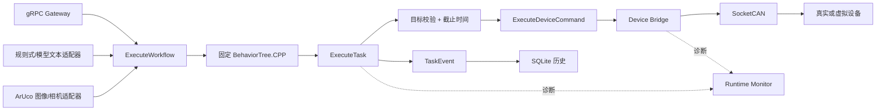

# Embodied Agent Runtime

[English](README.md) | **简体中文**

[](https://github.com/Quchaosheng/embodied-agent-runtime/actions/workflows/ros2-ci.yml)
[](https://docs.ros.org/)
[](LICENSE)

这是一个执行路径固定、可审查的 ROS 2 任务运行时。它将受控工作流请求交由
BehaviorTree.CPP 编排，经由嵌套 ROS 2 Action 和 SocketCAN 设备控制执行任务，
并记录运行时诊断与 SQLite 任务历史。

软件链路已经实现并通过测试。X5 原生 ARM64 运行、实体 USB 摄像头、ArUco 检测和
双 CANable 双向 SocketCAN 台架通信也已验证。电机运动和硬件急停回路不在当前证据
范围内，不能把台架通信或软件 `SAFE_STOP` 写成完整机器人闭环。

## 运行架构



模型和感知适配器不能直接控制设备，只能通过 `ExecuteWorkflow` 提交白名单工作流；
实际执行流保持固定、可审查。

## 已实现组件

| 包 | 职责 |
| --- | --- |
| `robot_task_interfaces` | ROS 2 Action、消息和服务契约 |
| `runtime_can` | 固定经典 CAN 协议编解码与校验 |
| `virtual_can_device` | 正常、故障、延迟和丢 ACK 测试用软件 ECU |
| `device_bridge` | SocketCAN 命令、ACK 重试、STOP、取消和诊断 |
| `task_executor` | 目标白名单、截止时间预算、嵌套 Action 和 `TaskEvent` |
| `runtime_monitor` | 聚合 readiness 及降级/错误诊断 |
| `runtime_history` | SQLite 任务持久化、查询和百分位统计 |
| `task_orchestrator` | 固定 BehaviorTree.CPP 工作流和有界子任务取消 |
| `runtime_gateway` | Loopback gRPC、请求身份、去重和 Action 桥接 |
| `ai_task_adapter` | 确定性规则规划器和可选 OpenAI 兼容模型适配器 |
| `perception_task_adapter` | 可选 ArUco 图像或 USB 相机触发器 |

## 已验证的软件证据

2026-07-29，本机 WSL2/Jazzy 隔离构建完成 **11 个包、120 个 GoogleTest 用例和
18 个 pytest 用例**。`colcon test-result` 的聚合记录还包含测试运行器与
`ament_lint` 条目，不能把聚合数写成行为用例数。GitHub Actions 也通过 Windows
工具检查，以及 Ubuntu 24.04/Jazzy 构建、测试、ARM64 配置和条件式 `vcan0` 工作流。

当前 11 包代码也已在 Ubuntu 22.04 / ROS 2 Humble 的 X5 上原生构建。顺序执行的
ARM smoke 通过 **311 个测试、0 错误、0 失败、72 跳过**。Humble smoke 只排除
发行版自带的 `uncrustify` 0.72，因为它与 CI 使用的 Jazzy 标准格式器输出不一致；
代码风格仍由 Jazzy CI 强制检查。X5 还验证了模型适配器默认禁用会拒绝运行，并从
本地假接口严格解析出 `single_task/dock_a/1000 ms`；随后在故意离线的
`ExecuteWorkflow` 处停止，没有触碰 CAN。

2026-07-28，实体 UVC 摄像头通过 `/dev/video0` 连续 30/30 帧识别出
`DICT_4X4_50` 的 ID 10 标记。两只 CANable2 也被识别为 `can1`、`can2`，并通过
`cansend`/`candump` 完成双向经典 CAN 帧收发，接口错误计数为 0。这是收发器台架
证据，不是电机或机器人闭环证据。

工业 `vcan0` E2E 覆盖正常、设备故障、取消、STOP ACK 丢失、普通 ACK 超时、
重复请求去重和 SQLite 统计七个场景：

```bash
WORKSPACE="$PWD/ros2_ws" SETUP_VCAN=0 bash scripts/run_industrial_e2e.sh
```

`vcan0`、虚拟设备、生成图像和 Fake Action 服务器都是测试替身，不是物理硬件证据。

## 快速开始

### Windows + WSL2

在 Windows PowerShell 的仓库根目录运行：

```powershell
powershell.exe -NoProfile -ExecutionPolicy Bypass `
  -File .\scripts\windows_wsl.ps1 -Mode Check

powershell.exe -NoProfile -ExecutionPolicy Bypass `
  -File .\scripts\windows_wsl.ps1 -Mode BuildTest
```

默认发行版是 `Ubuntu-24.04`。脚本不会调用 `sudo`，构建产物保存在 WSL 原生的
`$HOME/.cache/embodied-agent-runtime-wsl`。使用 `-DryRun` 可预览行为。

### Ubuntu 24.04 / ROS 2 Jazzy

```bash
set +u
source /opt/ros/jazzy/setup.bash
set -u
cd ros2_ws
rosdep install --from-paths src --ignore-src --rosdistro jazzy -y
colcon build --cmake-args -DBUILD_TESTING=ON
colcon test --return-code-on-test-failure
colcon test-result --test-result-base build --verbose
```

### 原生 ARM64

ARM 板上不得复用 x86_64 的 `build`、`install` 或 `log` 目录。

```bash
RUNTIME_PLATFORM_PROFILE=generic-arm64 ROS_DISTRO=jazzy \
  bash scripts/check_arm64_environment.sh
bash scripts/build_on_arm64.sh
bash scripts/run_arm64_smoke.sh
```

RK3568 的 Ubuntu 22.04 镜像使用受支持的 Humble 组合：

```bash
RUNTIME_PLATFORM_PROFILE=rk3568 ROS_DISTRO=humble \
  bash scripts/check_arm64_environment.sh
RUNTIME_PLATFORM_PROFILE=rk3568 ROS_DISTRO=humble \
  bash scripts/build_on_arm64.sh
RUNTIME_PLATFORM_PROFILE=rk3568 ROS_DISTRO=humble \
  bash scripts/run_arm64_smoke.sh
```

ARM 脚本只接受 Jazzy/Ubuntu 24.04 和 Humble/Ubuntu 22.04 配对。
ARM smoke 会顺序执行各包测试，避免小型板卡上的 ROS 发现和资源竞争。

## 可选工作流输入

原有 C++ `ai_task_adapter` 继续提供离线、确定性的规则匹配。新增的
`ai_model_adapter_node.py` 可以调用 OpenAI 兼容的 Chat Completions 接口，但默认
禁用。模型输出必须严格只含 `workflow_id`、`target_id`、`duration_ms` 三个字段，
并通过白名单和时限校验后才能提交 `ExecuteWorkflow`；模型不能直接发送 CAN 或设备
命令。

使用带密钥的接口时必须使用 HTTPS；密钥只放环境变量，不写入 YAML 或日志：

```bash
export OPENAI_API_KEY='replace-me'
ros2 run ai_task_adapter ai_model_adapter_node.py --ros-args \
  --params-file "$(ros2 pkg prefix ai_task_adapter)/share/ai_task_adapter/config/ai_model_adapter.yaml" \
  -p request:='去 dock_a。'
```

使用本地 Ollama 兼容接口时，将 `model_endpoint` 改为
`http://127.0.0.1:11434/v1/chat/completions`，`model_name` 改为已安装模型，并把
`api_key_env` 设为空字符串。请求有超时限制、拒绝重定向，响应最大 1 MiB；额外字段、
输入最多 4096 字符、输出最多 128 tokens。额外字段、越界时长和非白名单目标都会在
进入 ROS Action 前失败关闭。Goal 响应和 Action 结果同样有超时边界；结果超时会请求
取消并按失败退出。

CI 使用本地假模型接口验证 HTTP 协议和 5 个契约用例。目前不宣称真实 OpenAI 或
Ollama 的推理质量；只有配置真实服务并完成录制后才补 AI 演示视频。

`perception_task_adapter` 从图像或 USB 相机检测 `DICT_4X4_50` 标记，并通过
`ExecuteWorkflow` 提交：ID `10` 映射 `single_task/dock_a`，ID `20` 映射
`ready_then_task/home`。相机模式要求连续三帧一致、抑制重复提交，在五帧空画面后
重新启用，并拒绝包含多个已映射标记的画面。CI 感知测试使用生成图像，下面单独
展示 X5 实体摄像头证据。

模型路径同时提供显式的 `openai_compatible`、`mock` 和 `replay` backend。通过校验的
决策可按请求指纹和输出版本写入不含原始请求、API Key 的规范化 JSONL，并做确定性
回放。Observation TTL、推理 deadline、重复请求、过期输出、超时、服务崩溃、重复
响应和失败风暴都在 `ExecuteWorkflow` 前失败关闭；可选指标文件记录模型延迟、拒绝率、
降级率和任务成功率。后端失败不会暗中变成 mock 运动。

## 平台状态

| 环境 | 当前状态 | 证据 |
| --- | --- | --- |
| Windows + WSL2 x86_64 | 软件已验证 | 隔离 Jazzy 构建、120 个 GoogleTest 用例和 18 个 pytest 用例 |
| Ubuntu 24.04 + Jazzy x86_64 | CI 已验证 | 构建、测试、配置检查和条件式 `vcan0` E2E |
| 通用 ARM64 Linux | X5 已验证，其他板卡已准备 | X5 原生 Humble 构建/测试和可移植脚本 |
| RK3568 | CPU-only ARM64 配置，等待原生运行 | 不声明厂商 NPU/GPIO/相机能力 |
| X5 | 原生运行时和实体 I/O 台架已验证 | Humble 构建、311 项 ARM smoke、受限假模型检查、UVC ArUco 和双 CANable 通信 |
| 32-bit ARM | 不支持 | 运行时目标为 64-bit Linux |

## 硬件演示

**状态：X5 原生运行、实体 UVC/ArUco 输入和双 USB-CAN 台架链路已验证；不声明
电机或硬件急停已经验证。**

[](docs/assets/x5-aruco-live-demo.mp4)

[6 秒裁切真机演示](docs/assets/x5-aruco-live-demo.mp4)只保留纸张和状态面板，展示
连续三帧确认以及 `single_task/dock_a` 映射。录制时工作流 Action 服务器保持离线，
因此没有发送工作流 CAN 帧，也没有运动命令。

双 CANable 台架测试独立使用实体 `can1`/`can2` 完成两个方向的 `cansend`/`candump`。
它证明 Linux SocketCAN、USB-CAN 和接线可用，不代表已经验证电机行为。

## 证据边界

| 已证明 | 尚未证明 |
| --- | --- |
| 固定工作流和嵌套 ROS 2 Action | 模型动态生成控制流 |
| 本地假接口验证的严格 OpenAI 兼容模型契约 | 真实模型质量、可用性或提示词准确率 |
| X5 实体 UVC 和稳定 ArUco ID 10 检测 | 相机标定、复杂光照覆盖或模型准确率 |
| 双适配器物理 SocketCAN 通信和 `vcan0` 协议测试 | 执行器行为或机器人闭环控制 |
| 软件 `SAFE_STOP` 和持久化任务证据 | 硬件急停或实测停止距离 |
| x86_64 Jazzy 和 X5/Humble 原生运行 | RK3568 原生执行和厂商加速器 |

Loopback Gateway 尚未提供 TLS、身份认证、高可用或生产吞吐量证据。

## 许可证

项目使用 [Apache License 2.0](LICENSE)。第三方归属见
[THIRD_PARTY_NOTICES.md](THIRD_PARTY_NOTICES.md)。
