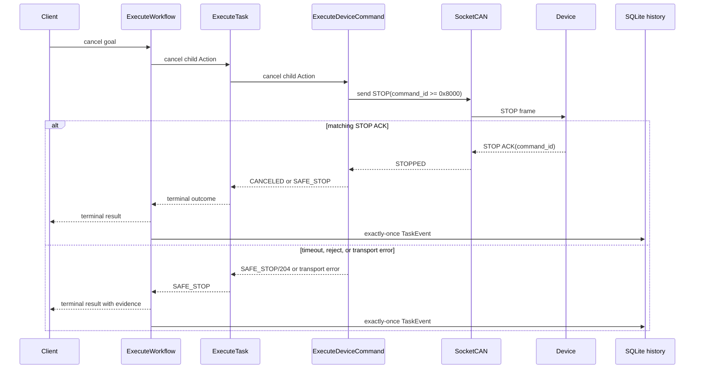
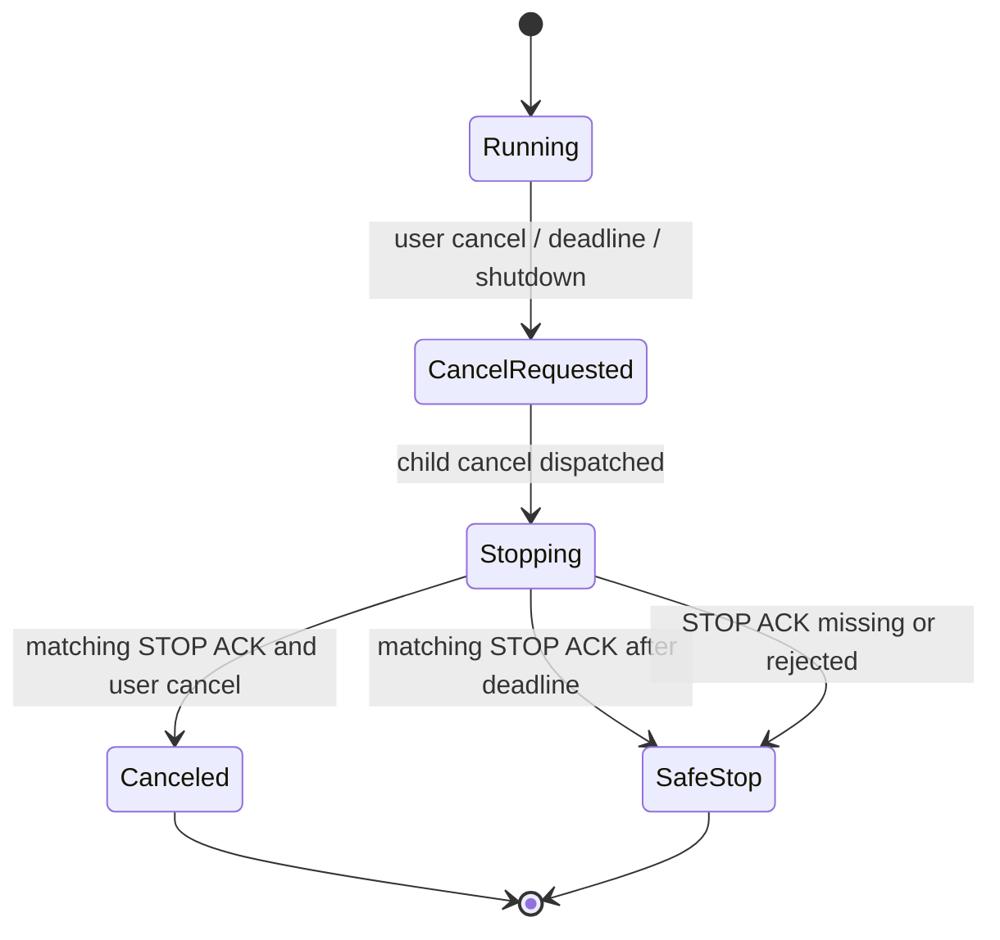

# Cancel and STOP Evidence

The runtime treats a cancellation request as an intent. It does not report a
device stop until the Device Bridge has sent a protocol STOP command and
received the matching STOP acknowledgement.

Evidence boundary:

- `CANCELED` or `SAFE_STOP` proves the software protocol outcome.
- A matching STOP ACK proves the device protocol response, not physical motor
  motion or a measured stopping distance.
- `TaskEvent` is written once with `INSERT OR IGNORE`; a duplicate callback
  cannot create a second terminal history row.
